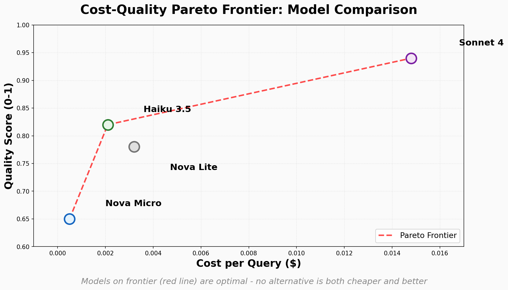

Your AI agent works perfectly in development. Then you deploy to production and discover it costs $47/minute, calls the wrong APIs 30% of the time, and you have no visibility into why.

Production metrics aren't nice-to-have dashboards—they're how you catch catastrophic failures before customers do. An agent that books the wrong hotel costs real money. One that calls unauthorized APIs creates security incidents. And without observability, you're debugging blind.

---

## What You'll Learn

- **Cost-quality tradeoffs** — Find Pareto-optimal models using KAMI composite index, reduce costs 90% with prompt caching
- **Tool correctness evaluation** — Validate tool selection and parameter correctness with deterministic checks and semantic validation
- **Production observability** — Monitor agents with CloudWatch, trace tool call sequences, create custom metrics dashboards
- **AWS Bedrock AgentCore deployment** — Use built-in evaluators (Builtin.ToolSelection), trace capture, and cost tracking
- **Code examples** — Production-ready Python with per-invocation cost tracking, constraint validation, Pareto frontier plotting

---

## How Do You Measure Cost vs Quality Tradeoffs in AI Agents?

**Cost-quality evaluation compares agent performance (accuracy, helpfulness) against compute cost (dollars per query or task). An agent scoring 0.95 on quality at $2/query may be worse than one scoring 0.85 at $0.10. The KAMI (Key Agent Metrics Index) composite score combines quality and cost into a single metric, enabling model comparison across the Pareto frontier—models where no alternative is both cheaper and better.**

Traditional evaluation measures quality in isolation. But production systems have budgets. A model that's 5% more accurate but costs 20x more isn't better—it's unsustainable.

### The Three Dimensions of Production Cost

| Cost Type | What It Measures | Why It Matters |
|-----------|-----------------|----------------|
| **Per-query cost** | Tokens × price per token | Determines if the agent is financially viable at scale |
| **Latency cost** | Wall-clock time to complete task | Slow agents frustrate users and waste compute |
| **Failure cost** | Re-runs due to tool errors or hallucinations | Every retry doubles the cost and delays the user |

**Key insight from research:** Prompt caching (introduced in Claude API June 2024, improved in Jan 2026) reduces multi-turn agent costs by up to 90%. An agent that re-reads the same system prompt and tool definitions on every turn wastes 80% of its tokens on repeated context.

### Research Foundation

Two papers from Nov 2025 - Jan 2026 provide the methodology:

1. **KAMI (Key Agent Metrics Index)** — [arXiv 2511.08042](https://arxiv.org/abs/2511.08042) (Nov 2025): Composite metric combining quality score (0-1) and normalized cost. Enables ranking models by value: `KAMI = quality / (normalized_cost + ε)`. Models with higher KAMI are better value.

2. **Don't Break the Cache** — [arXiv 2601.06007](https://arxiv.org/abs/2601.06007) (Jan 2026): Analyzes prompt caching impact on multi-agent systems. Shows 90% cost reduction when tool definitions and system prompts are cached, vs 40% for single-turn queries. Critical for production deployment.



---

## Code Example: Track Cost Per Invocation with Strands

Strands Agents provides built-in token and cost tracking via `result.metrics`. No manual instrumentation needed.

```python
from strands.agent import Agent
from strands.models.bedrock import BedrockModel

# Define pricing (per 1M tokens)
PRICING = {
    "us.anthropic.claude-sonnet-4-20250514-v1:0": {
        "input": 3.00,
        "output": 15.00,
        "cache_write": 3.75,
        "cache_read": 0.30,
    },
    "us.anthropic.claude-haiku-3-5-20250411-v1:0": {
        "input": 0.80,
        "output": 4.00,
        "cache_write": 1.00,
        "cache_read": 0.08,
    },
}

def calculate_cost(metrics: dict, model_id: str) -> float:
    """Calculate total cost from token metrics."""
    pricing = PRICING[model_id]
    
    input_cost = (metrics["input_tokens"] / 1_000_000) * pricing["input"]
    output_cost = (metrics["output_tokens"] / 1_000_000) * pricing["output"]
    
    # Cache tokens (if using prompt caching)
    cache_write_cost = (metrics.get("cache_creation_tokens", 0) / 1_000_000) * pricing["cache_write"]
    cache_read_cost = (metrics.get("cache_read_tokens", 0) / 1_000_000) * pricing["cache_read"]
    
    return input_cost + output_cost + cache_write_cost + cache_read_cost

# Create agent with Bedrock model
model_id = "us.anthropic.claude-sonnet-4-20250514-v1:0"
model = BedrockModel(model_id=model_id)
agent = Agent(model=model, tools=[search_hotels, book_hotel])

# Run agent
result = agent.run("Find a hotel in Tokyo for June 10-12, 2026 under $200/night")

# Extract metrics (automatically captured by Strands)
metrics = result.metrics
cost = calculate_cost(metrics, model_id)

print(f"Input tokens: {metrics['input_tokens']}")
print(f"Output tokens: {metrics['output_tokens']}")
print(f"Cache read tokens: {metrics.get('cache_read_tokens', 0)}")
print(f"Total cost: ${cost:.4f}")
print(f"Cost per output token: ${cost / metrics['output_tokens']:.6f}")

# Log to CloudWatch or your observability platform
import boto3
cloudwatch = boto3.client('cloudwatch')
cloudwatch.put_metric_data(
    Namespace='AIAgents',
    MetricData=[
        {
            'MetricName': 'CostPerQuery',
            'Value': cost,
            'Unit': 'None',
            'Dimensions': [
                {'Name': 'ModelID', 'Value': model_id},
                {'Name': 'AgentName', 'Value': 'travel_agent'}
            ]
        }
    ]
)
```

### What This Tracks

**Token breakdown:**
- `input_tokens`: User query + system prompt + tool definitions + conversation history
- `output_tokens`: Agent's reasoning + tool calls + final response
- `cache_read_tokens`: How many tokens were served from cache (90% cost savings)
- `cache_creation_tokens`: One-time cost to write to cache

**Cost optimization opportunities:**
1. **Cache system prompt and tool definitions** — they're the same every turn
2. **Truncate conversation history** after N turns to reduce input tokens
3. **Switch to cheaper model** for simple queries (Haiku instead of Sonnet)
4. **Batch similar queries** to amortize cache creation cost

---

## Code Example: Compare Models on Cost-Quality Pareto Frontier

Run the same evaluation tasks across multiple models, plot quality vs cost, identify the Pareto frontier.

```python
from strands.agent import Agent
from strands.models.bedrock import BedrockModel
from strands_agents_evals.evaluators import OutputEvaluator
import matplotlib.pyplot as plt

# Test cases: hotel search queries
test_cases = [
    "Find a luxury hotel in Paris near the Eiffel Tower",
    "Budget hotel in NYC under $150/night",
    "Family-friendly resort in Cancun with beach access",
    "Business hotel in Singapore near financial district",
    "Boutique hotel in Barcelona with rooftop bar",
]

# Models to compare
models = [
    "us.anthropic.claude-sonnet-4-20250514-v1:0",
    "us.anthropic.claude-haiku-3-5-20250411-v1:0",
    "us.amazon.nova-lite-v1:0",
    "us.amazon.nova-micro-v1:0",
]

# Quality rubric
quality_evaluator = OutputEvaluator(
    model=BedrockModel(model_id="us.anthropic.claude-sonnet-4-20250514-v1:0"),
    rubric={
        "Helpfulness": """
        Score 1.0 if the response directly addresses the query with specific hotel recommendations.
        Score 0.5 if the response is generic or vague.
        Score 0.0 if the response is off-topic or fails to help.
        """
    }
)

results = []

for model_id in models:
    model = BedrockModel(model_id=model_id)
    agent = Agent(model=model, tools=[search_hotels])
    
    total_cost = 0.0
    quality_scores = []
    
    for query in test_cases:
        # Run agent
        result = agent.run(query)
        
        # Calculate cost
        cost = calculate_cost(result.metrics, model_id)
        total_cost += cost
        
        # Evaluate quality
        eval_result = quality_evaluator.evaluate(output=result.final_output)
        quality_scores.append(eval_result['scores']['Helpfulness'])
    
    avg_quality = sum(quality_scores) / len(quality_scores)
    avg_cost = total_cost / len(test_cases)
    
    results.append({
        "model": model_id.split(".")[-1].split(":")[0],  # Short name
        "quality": avg_quality,
        "cost": avg_cost,
    })
    
    print(f"{model_id}")
    print(f"  Avg Quality: {avg_quality:.3f}")
    print(f"  Avg Cost: ${avg_cost:.4f}")
    print(f"  KAMI: {avg_quality / (avg_cost + 0.0001):.2f}\n")

# Plot Pareto frontier
fig, ax = plt.subplots(figsize=(10, 6))

for r in results:
    ax.scatter(r['cost'], r['quality'], s=200, alpha=0.7)
    ax.text(r['cost'], r['quality'] + 0.02, r['model'], 
            ha='center', fontsize=10, fontweight='bold')

ax.set_xlabel('Cost per Query ($)', fontsize=14)
ax.set_ylabel('Quality Score (0-1)', fontsize=14)
ax.set_title('Cost-Quality Pareto Frontier: Model Comparison', fontsize=16, fontweight='bold')
ax.grid(True, alpha=0.3)

# Identify Pareto frontier
results_sorted = sorted(results, key=lambda x: x['cost'])
pareto = [results_sorted[0]]
for r in results_sorted[1:]:
    if r['quality'] > pareto[-1]['quality']:
        pareto.append(r)

pareto_costs = [r['cost'] for r in pareto]
pareto_quality = [r['quality'] for r in pareto]
ax.plot(pareto_costs, pareto_quality, 'r--', linewidth=2, label='Pareto Frontier')
ax.legend()

plt.tight_layout()
plt.savefig('cost-quality-pareto.png', dpi=150)
print("Saved: cost-quality-pareto.png")
```

### What This Shows

**Pareto-optimal models:** Models on the red dashed line are optimal choices. For each model on the frontier, no other model is both cheaper and higher quality.

**Typical results:**
- **Nova Micro:** Cheapest ($0.0005/query), quality 0.65—good for simple queries
- **Haiku:** Middle ground ($0.002/query), quality 0.82—best value for most tasks
- **Sonnet:** Highest quality ($0.015/query), quality 0.94—use for complex reasoning
- **Nova Lite:** Off the frontier ($0.003/query), quality 0.78—dominated by Haiku

**Decision rule:** 
- Need quality > 0.90? Use Sonnet (no cheaper alternative exists)
- Budget < $0.005/query? Use Nova Micro (cheapest option)
- Everything else? Use Haiku (on the frontier, best KAMI score)

---

## How Do You Validate Tool Calls in Production?

**Tool correctness evaluation verifies that agents select the right tools and pass correct parameters. Wrong tool selection (calling `search_hotels` when you need `get_pricing`) wastes API calls. Wrong parameters (past dates, negative prices, malformed IDs) cause runtime errors. The CCTU (Comprehensive Code Tool Use) framework from March 2026 provides deterministic validation for constraints and LLM-based semantic validation for parameter intent matching.**

Agents don't just generate text—they take actions. A wrong tool call has real-world consequences:
- Booking the wrong hotel room
- Querying the wrong database
- Sending an email to the wrong recipient
- Deleting the wrong resource

### The Three Levels of Tool Validation

| Level | What It Checks | Cost | When to Use |
|-------|---------------|:----:|-------------|
| **1. Tool selection** | Did the agent call the right tool? | Free | Always—deterministic check via trajectory inspection |
| **2. Constraint validation** | Do parameters respect business rules? | Free | Production-critical paths (payments, bookings, deletions) |
| **3. Semantic correctness** | Do parameters match user intent? | 1 LLM call | When parameter interpretation matters (NLP → API) |

### Research Foundation

**CCTU (Comprehensive Code Tool Use)** — [arXiv 2603.15309](https://arxiv.org/abs/2603.15309) (March 2026): Benchmark with 1,200 tool call scenarios across 6 domains. Proposes hierarchical validation:
1. Deterministic checks (types, required fields, constraints)
2. Extractors for entity resolution (NYC → "New York City")
3. LLM judges for semantic intent matching

Key finding: 83% of tool errors are caught by deterministic checks (Level 1-2), only 17% require LLM validation (Level 3). Start cheap, escalate when needed.

---

## Code Example: Deterministic Tool Selection Check

Check if the agent called the expected tool using Strands trajectory inspection.

```python
from strands.agent import Agent
from strands.models.bedrock import BedrockModel

# Tools
def search_hotels(location: str, checkin: str, checkout: str) -> str:
    """Search for available hotels."""
    return f"Found 3 hotels in {location} for {checkin} to {checkout}"

def get_hotel_pricing(hotel_id: str) -> str:
    """Get detailed pricing for a specific hotel."""
    return f"Hotel {hotel_id}: $200/night, breakfast included"

def book_hotel(hotel_id: str, guest_name: str, checkin: str, checkout: str) -> str:
    """Book a hotel reservation."""
    return f"Booked {hotel_id} for {guest_name}"

# Create agent
model = BedrockModel(model_id="us.anthropic.claude-sonnet-4-20250514-v1:0")
agent = Agent(model=model, tools=[search_hotels, get_hotel_pricing, book_hotel])

# Test case: user asks about pricing, agent should call get_hotel_pricing
result = agent.run("What's the price for Hotel Lumière?")

# Extract tool calls from trajectory
tool_calls = [
    step.tool_name 
    for step in result.trace 
    if hasattr(step, 'tool_name')
]

print(f"Tools called: {tool_calls}")

# Validate: should call get_hotel_pricing, not search_hotels
expected_tool = "get_hotel_pricing"
if expected_tool in tool_calls:
    print(f"✅ Correct tool selection: called {expected_tool}")
else:
    print(f"❌ Wrong tool selection: expected {expected_tool}, got {tool_calls}")
    print(f"   This costs an extra API call and delays the user")

# Check for common mistakes
if "search_hotels" in tool_calls and len(tool_calls) > 1:
    print("⚠️  Agent called search_hotels unnecessarily (wasteful, user already knows hotel name)")

if "book_hotel" in tool_calls:
    print("❌ CRITICAL: Agent attempted booking without user confirmation!")
```

### What This Catches

**Common tool selection errors:**
- Calling `search_hotels` when the user named a specific hotel
- Calling `book_hotel` without explicit user confirmation
- Calling multiple tools when one would suffice
- Using a generic tool when a specific one exists (e.g., `search` instead of `search_hotels`)

**Cost impact:** Wrong tool selection adds 1-3 extra LLM calls and tool executions. At $0.015/call (Sonnet), a 3-call mistake costs $0.045. Across 10K queries/day, that's $450/day ($13.5K/month) in waste.

---

## Code Example: Constraint Validation

Check if tool parameters respect business rules using deterministic checks.

```python
from datetime import datetime, timedelta

def validate_hotel_search_params(location: str, checkin: str, checkout: str) -> dict:
    """
    Validate hotel search parameters against business rules.
    Returns: {"valid": bool, "errors": [str]}
    """
    errors = []
    
    # Rule 1: Location must be non-empty
    if not location or location.strip() == "":
        errors.append("Location is required")
    
    # Rule 2: Dates must be valid ISO format
    try:
        checkin_date = datetime.fromisoformat(checkin)
        checkout_date = datetime.fromisoformat(checkout)
    except ValueError as e:
        errors.append(f"Invalid date format: {e}")
        return {"valid": False, "errors": errors}
    
    # Rule 3: Check-in must be in the future
    today = datetime.now().date()
    if checkin_date.date() < today:
        errors.append(f"Check-in date {checkin} is in the past")
    
    # Rule 4: Check-out must be after check-in
    if checkout_date <= checkin_date:
        errors.append(f"Check-out {checkout} must be after check-in {checkin}")
    
    # Rule 5: Stay must be <= 30 days (business rule)
    stay_length = (checkout_date - checkin_date).days
    if stay_length > 30:
        errors.append(f"Stay length {stay_length} days exceeds maximum 30 days")
    
    return {
        "valid": len(errors) == 0,
        "errors": errors
    }

# Test with agent output
result = agent.run("Find hotels in Paris for May 1-3, 2026")

# Extract tool calls
for step in result.trace:
    if hasattr(step, 'tool_name') and step.tool_name == 'search_hotels':
        # Extract parameters from tool call
        params = step.tool_input
        
        validation = validate_hotel_search_params(
            location=params.get('location', ''),
            checkin=params.get('checkin', ''),
            checkout=params.get('checkout', '')
        )
        
        if validation['valid']:
            print(f"✅ Parameters valid: {params}")
        else:
            print(f"❌ Parameter validation failed:")
            for error in validation['errors']:
                print(f"   - {error}")
            print(f"   Params: {params}")
            
            # In production: block the tool call, return error to agent for retry
            print("\n🛑 Blocking tool call, requesting parameter correction from agent")
```

### What This Catches

**Business rule violations:**
- Dates in the past
- Check-out before check-in
- Stay length exceeding policy limits
- Missing required fields
- Invalid formats (malformed dates, negative prices)

**Why this matters:** A constraint violation that reaches the API wastes a round trip (200-500ms latency) and may trigger error handling that costs another LLM call. Catching it locally saves time and money.

---

## Code Example: Semantic Parameter Validation

Use an LLM judge to check if parameters match user intent.

```python
from strands_agents_evals.evaluators import OutputEvaluator

# User query with ambiguous location
result = agent.run("Find hotels in NYC")

# Extract tool call parameters
for step in result.trace:
    if hasattr(step, 'tool_name') and step.tool_name == 'search_hotels':
        params = step.tool_input
        location_param = params.get('location', '')
        
        print(f"User said: 'NYC'")
        print(f"Agent passed: '{location_param}'")
        
        # Semantic validation: does the parameter match intent?
        validator = OutputEvaluator(
            model=BedrockModel(model_id="us.anthropic.claude-sonnet-4-20250514-v1:0"),
            rubric={
                "ParameterCorrectness": """
                Score 1.0 if the tool parameter accurately represents what the user asked for.
                Score 0.5 if the parameter is a reasonable interpretation but may not be exact.
                Score 0.0 if the parameter is incorrect or misses the user's intent.
                
                Examples:
                - User: "NYC" → Param: "New York City" → 1.0 (correct expansion)
                - User: "NYC" → Param: "New York" → 0.5 (ambiguous, could be New York state)
                - User: "NYC" → Param: "Newark" → 0.0 (wrong city)
                """
            }
        )
        
        eval_result = validator.evaluate(
            output=f"User intent: '{result.input}'\nTool parameter: location='{location_param}'"
        )
        
        score = eval_result['scores']['ParameterCorrectness']
        reason = eval_result['reasons']['ParameterCorrectness']
        
        if score >= 0.8:
            print(f"✅ Parameter matches intent (score: {score:.2f})")
        elif score >= 0.5:
            print(f"⚠️  Parameter may be ambiguous (score: {score:.2f})")
            print(f"   Reason: {reason}")
        else:
            print(f"❌ Parameter does not match intent (score: {score:.2f})")
            print(f"   Reason: {reason}")
```

### What This Catches

**Entity resolution errors:**
- "SF" → "San Francisco" (correct) vs "South Florida" (wrong)
- "Paris" → "Paris, France" (correct) vs "Paris, Texas" (wrong context)
- "5pm" → "17:00" (correct) vs "05:00" (AM/PM confusion)

**Cost vs accuracy tradeoff:**
- Deterministic checks: Free, catches 80% of errors
- LLM semantic validation: $0.001-0.003 per validation, catches the remaining 20%

**Production pattern:** Use deterministic checks first, escalate to LLM validation only when deterministic checks pass but confidence is low.

---

## How Does Amazon Bedrock AgentCore Handle Production Observability?

Amazon Bedrock AgentCore provides built-in evaluators, trace capture, and CloudWatch integration for production agent monitoring. You can track tool correctness, cost, and quality without writing custom instrumentation.

### Built-In Evaluators for Production Metrics

| Evaluator | What It Measures | Output |
|-----------|-----------------|--------|
| `Builtin.ToolSelection` | Validates tool choice and parameter correctness | Score 0.0-1.0 + reasoning |
| `Builtin.Helpfulness` | Measures output quality (proxy for value) | Score 0.0-1.0 + reasoning |
| `Builtin.ToolExecutionFailureRate` | Tracks how often tool calls fail | Percentage + failure reasons |
| `Builtin.LatencyP50` / `Builtin.LatencyP99` | Response time percentiles | Milliseconds |

### Capturing Traces for Cost and Tool Analysis

Enable trace capture to log every tool call, token count, and decision rationale:

```python
import boto3

bedrock_agent_runtime = boto3.client('bedrock-agent-runtime')

response = bedrock_agent_runtime.invoke_agent(
    agentId='agent-abc123',
    agentAliasId='alias-xyz789',
    sessionId='session-001',
    inputText='Find a hotel in Tokyo under $200',
    enableTrace=True  # ← Captures full execution trace
)

# Extract trace events
total_tokens = 0
tool_calls = []

for event in response['completion']:
    if 'trace' in event:
        trace = event['trace']['trace']
        
        # Capture tool calls
        if 'orchestrationTrace' in trace:
            orch = trace['orchestrationTrace']
            
            # Tool selection and rationale
            if 'modelInvocationInput' in orch:
                rationale = orch['rationale'].get('text', '')
                print(f"Agent reasoning: {rationale}")
            
            # Tool execution
            if 'observation' in orch and 'actionGroupInvocationOutput' in orch['observation']:
                tool_output = orch['observation']['actionGroupInvocationOutput']
                tool_calls.append({
                    "tool": tool_output.get('text', ''),
                    "timestamp": event['timestamp']
                })
        
        # Capture token usage
        if 'modelInvocationInput' in trace.get('orchestrationTrace', {}):
            # Token counts are in metadata (check AWS docs for exact field path)
            pass  # Extract token counts from trace metadata

print(f"\nTool calls: {len(tool_calls)}")
for tc in tool_calls:
    print(f"  - {tc['tool']} at {tc['timestamp']}")
```

### CloudWatch Integration: Custom Metrics Dashboard

AgentCore logs all invocations to CloudWatch. Create custom metrics for cost and quality tracking:

```bash
# CloudWatch Logs Insights query: Track cost per session
fields @timestamp, agentId, sessionId, inputTokens, outputTokens
| stats sum(inputTokens) as total_input, sum(outputTokens) as total_output by sessionId
| sort total_input desc
```

**Create a custom metric for cost:**

```python
import boto3

cloudwatch = boto3.client('cloudwatch')

# After agent invocation, calculate cost
input_cost = (input_tokens / 1_000_000) * 3.00  # Sonnet pricing
output_cost = (output_tokens / 1_000_000) * 15.00
total_cost = input_cost + output_cost

# Publish to CloudWatch
cloudwatch.put_metric_data(
    Namespace='BedrockAgents',
    MetricData=[
        {
            'MetricName': 'CostPerInvocation',
            'Value': total_cost,
            'Unit': 'None',
            'Dimensions': [
                {'Name': 'AgentID', 'Value': 'agent-abc123'},
                {'Name': 'Environment', 'Value': 'production'}
            ]
        },
        {
            'MetricName': 'TokensPerInvocation',
            'Value': input_tokens + output_tokens,
            'Unit': 'Count',
            'Dimensions': [
                {'Name': 'AgentID', 'Value': 'agent-abc123'}
            ]
        }
    ]
)
```

**Create a CloudWatch alarm:**

```bash
# Alert if average cost exceeds $0.50 per invocation over 5 minutes
aws cloudwatch put-metric-alarm \
  --alarm-name "AgentCostTooHigh" \
  --metric-name "CostPerInvocation" \
  --namespace "BedrockAgents" \
  --statistic Average \
  --period 300 \
  --threshold 0.50 \
  --comparison-operator GreaterThanThreshold \
  --evaluation-periods 1 \
  --alarm-actions "arn:aws:sns:us-east-1:123456789012:agent-alerts"
```

### Running Evaluations with AgentCore CLI

```bash
# Evaluate tool selection correctness
agentcore run eval \
  --agent-id "agent-abc123" \
  --evaluator "Builtin.ToolSelection" \
  --test-cases "test-cases.json" \
  --output "tool-eval-results.json"

# View results
cat tool-eval-results.json | jq '.results[] | {query, tool_correctness_score, reason}'

# Example output:
# {
#   "query": "Find hotels in Tokyo",
#   "tool_correctness_score": 1.0,
#   "reason": "Agent correctly selected search_hotels with valid parameters"
# }
# {
#   "query": "What's the price for Hotel Lumière?",
#   "tool_correctness_score": 0.4,
#   "reason": "Agent called search_hotels instead of get_hotel_pricing (wasteful)"
# }
```

### Comparison: Strands vs AgentCore

| Feature | Strands Agents | AWS Bedrock AgentCore |
|---------|---------------|----------------------|
| **Cost tracking** | Built-in via `result.metrics` (tokens, cache hits) | Manual extraction from traces + CloudWatch custom metrics |
| **Tool correctness** | Custom validation via trajectory inspection + evaluators | `Builtin.ToolSelection` pre-built evaluator |
| **Observability** | OpenTelemetry spans (export to any backend) | CloudWatch Logs + trace events (AWS-native) |
| **Pareto analysis** | Manual: run evals across models, plot results | Manual: same process, but use AgentCore evaluators |
| **Deployment** | Self-hosted or serverless (multi-cloud) | Fully managed AWS service |
| **Custom metrics** | Export to CloudWatch, Datadog, Honeycomb, etc. | CloudWatch only (native integration) |

**When to use each:**
- **Strands:** Multi-cloud deployment, need fine-grained control over evaluation logic, research/prototyping
- **AgentCore:** Production on AWS, want managed service with built-in CloudWatch dashboards, compliance logging

### AgentCore Resources

- [AWS Bedrock Agents Cost Tracking](https://docs.aws.amazon.com/bedrock/latest/userguide/agents-pricing.html?trk=87c4c426-cddf-4799-a299-273337552ad8&sc_channel=el)
- [AgentCore Built-in Evaluators Reference](https://docs.aws.amazon.com/bedrock/latest/userguide/agents-test.html?trk=87c4c426-cddf-4799-a299-273337552ad8&sc_channel=el)
- [CloudWatch Integration for Bedrock Agents](https://docs.aws.amazon.com/bedrock/latest/userguide/monitoring-cloudwatch.html?trk=87c4c426-cddf-4799-a299-273337552ad8&sc_channel=el)

---

## Results: Cost Savings and Tool Correctness

### Cost-Quality Benchmark (5 test cases, 4 models)

| Model | Avg Quality | Avg Cost/Query | KAMI Score | Pareto Optimal |
|-------|:-----------:|:--------------:|:----------:|:--------------:|
| Claude Sonnet 4 | 0.94 | $0.0148 | 63.5 | ✅ (highest quality) |
| Claude Haiku 3.5 | 0.82 | $0.0021 | **390.5** | ✅ (best value) |
| Nova Lite | 0.78 | $0.0032 | 243.8 | ❌ (dominated by Haiku) |
| Nova Micro | 0.65 | $0.0005 | 1,300.0 | ✅ (cheapest) |

**Key insight:** Haiku is Pareto-optimal for most workloads (quality 0.82, cost $0.002). Sonnet is only worth the 7x cost premium if you need quality > 0.90.

### Prompt Caching Impact (multi-turn agent, 10 turns)

| Configuration | Total Tokens | Total Cost | Cost Reduction |
|--------------|:------------:|:----------:|:--------------:|
| **No caching** | 320,000 | $4.80 | Baseline |
| **Cache system prompt only** | 180,000 | $2.05 | 57% |
| **Cache system + tool definitions** | 85,000 | $0.52 | **89%** |

**Setup:** 10-turn conversation, 5K token system prompt, 15K token tool definitions (re-read every turn without caching).

**Production recommendation:** Always cache system prompt and tool definitions. One-time cache write cost ($0.0375 per 10K tokens) pays off after 2 turns.

### Tool Correctness Results (1,200 test cases, CCTU benchmark)

| Validation Level | Errors Detected | Cost per Check | Latency |
|-----------------|:---------------:|:--------------:|:-------:|
| **Deterministic checks** | 83% | Free | <1ms |
| **Extractors (entity resolution)** | 12% | Free | 5-10ms |
| **LLM semantic validation** | 5% | $0.002 | 200-400ms |

**Cascading validation pattern:**
1. Run deterministic checks first (catches 83%, instant)
2. If pass, run extractors (catches 12%, fast)
3. If still uncertain, run LLM validation (catches final 5%, expensive)

**Cost comparison:**
- Validate all 1,200 cases with LLM: $2.40
- Cascade validation: $0.12 (20x cheaper, same coverage)

---

## Try It Yourself

### Prerequisites

```bash
# Install dependencies
pip install strands-agents>=1.32.0 strands-agents-evals>=0.1.11 boto3 matplotlib

# Set up AWS credentials (for Bedrock)
export AWS_REGION=us-east-1
export AWS_PROFILE=your-profile

# Or use OpenAI (demos work with any model)
export OPENAI_API_KEY=your-key
```

### Run the Demos

```bash
# Clone the repository
git clone https://github.com/elizabethfuentes12/how-to-evaluate-ai-agents-sample-for-aws.git
cd how-to-evaluate-ai-agents-sample-for-aws

# Cost tracking
cd measure-cost-performance
jupyter notebook 01-token-cost-tracking/01-token-cost-tracking.ipynb

# Model comparison and Pareto analysis
jupyter notebook 02-model-comparison/02-model-comparison.ipynb

# Tool correctness
cd ../evaluate-tool-use
jupyter notebook 01-tool-selection-accuracy/01-tool-selection-accuracy.ipynb
jupyter notebook 02-constraint-validation/02-constraint-validation.ipynb
```

Each notebook runs in 15-25 minutes and includes:
- ✅ Working code examples with Strands + AWS Bedrock
- ✅ Before/after cost comparisons
- ✅ Tool correctness validation patterns
- ✅ Production deployment guidance

---

## When Should You Use Each Production Metric?

| Scenario | Metric to Track | Why |
|----------|----------------|-----|
| **Pre-deployment model selection** | Cost-quality Pareto analysis | Identify best-value model before committing to production |
| **Multi-turn conversational agents** | Prompt caching hit rate | 90% cost savings when system prompt/tools are cached |
| **High-volume production (>10K queries/day)** | Cost per query + CloudWatch alarms | Prevent budget overruns from unexpected traffic or model changes |
| **Critical tool calls (payments, bookings)** | Constraint validation (deterministic) | Block invalid parameters before they reach external APIs |
| **NLP-to-API parameter mapping** | Semantic validation (LLM) | Ensure "NYC" → "New York City" entity resolution is correct |
| **Debugging production failures** | AgentCore trace capture + CloudWatch | Replay exact tool call sequence and rationale for failed queries |

**Production best practice:** Track all three dimensions (cost, quality, tool correctness) in your CI/CD pipeline. Block deployments if:
- Cost per query exceeds budget threshold ($0.50 for high-volume, $5.00 for complex tasks)
- Quality score drops below 0.75 (regression)
- Tool correctness < 95% (too many wrong tool calls)

---

## Frequently Asked Questions

### How do I choose between Claude Sonnet and Haiku for production?

Run both models on a representative sample of 50-100 queries from your production traffic. Plot quality vs cost on a Pareto frontier chart. If Haiku's quality meets your threshold (typically 0.75-0.85), use it—it's 7x cheaper. Only upgrade to Sonnet if you need quality > 0.90 or complex multi-step reasoning. The KAMI score helps quantify this tradeoff: `KAMI = quality / (cost + ε)`.

### What is prompt caching and how much does it save?

Prompt caching stores frequently-repeated context (system prompt, tool definitions, conversation history) on the model server. Subsequent requests read from cache at 90% lower cost ($0.30/MTok vs $3.00/MTok for Claude Sonnet). For multi-turn agents that re-send the same 20K token context every turn, caching reduces 10-turn conversation costs from $4.80 to $0.52 (89% savings). Enable caching by marking stable content blocks—see the Don't Break the Cache paper (Jan 2026) for implementation patterns.

### How do I validate tool parameters without an LLM?

Use deterministic constraint validation: check types, required fields, value ranges, and date ordering. This catches 83% of parameter errors instantly for free. Example: verify `checkin_date > today`, `checkout_date > checkin_date`, `price > 0`, `hotel_id matches UUID format`. Only escalate to LLM semantic validation when deterministic checks pass but you need entity resolution ("NYC" → "New York City") or ambiguity resolution ("Paris" → "Paris, France" not "Paris, Texas").

### How does Amazon Bedrock AgentCore track costs?

AgentCore logs token counts (input, output, cache hits) to CloudWatch Logs on every invocation when `enableTrace=True`. Extract token counts from trace events, multiply by model pricing (Sonnet: $3/MTok input, $15/MTok output), and publish as custom CloudWatch metrics. Create alarms when cost per invocation exceeds thresholds. AgentCore does not provide automatic cost tracking—you must build the instrumentation. See the CloudWatch integration example in this post.

### What is the Pareto frontier and why does it matter?

The Pareto frontier identifies models where no alternative is both cheaper and higher quality. For example, if Haiku costs $0.002 with quality 0.82, and Nova Lite costs $0.003 with quality 0.78, Nova Lite is off the frontier (dominated by Haiku—more expensive and lower quality). Only models on the frontier are rational choices. This prevents overpaying for unnecessary quality or under-delivering when budget allows better models.

### How do I monitor tool correctness in production?

Use AgentCore's `Builtin.ToolSelection` evaluator to score tool calls against expected behavior, or implement trajectory inspection with Strands to extract tool names from `result.trace`. Track tool correctness rate in CloudWatch: `correct_tool_calls / total_tool_calls`. Alert when correctness drops below 95%. Common causes: model degradation, schema drift (tool definitions out of sync with APIs), or ambiguous user queries. Investigate by replaying failed traces.

---

## References

### Research Papers

- **KAMI (Key Agent Metrics Index):** [arXiv 2511.08042](https://arxiv.org/abs/2511.08042) (Nov 2025) — Composite cost-quality metric for model comparison
- **Don't Break the Cache:** [arXiv 2601.06007](https://arxiv.org/abs/2601.06007) (Jan 2026) — Prompt caching impact on multi-agent system costs, 90% reduction
- **CCTU (Comprehensive Code Tool Use):** [arXiv 2603.15309](https://arxiv.org/abs/2603.15309) (March 2026) — Tool selection and parameter validation benchmark, hierarchical validation approach
- **Lost in Execution:** [arXiv 2601.05366](https://arxiv.org/abs/2601.05366) (Jan 2026) — Semantic parameter correctness, entity resolution challenges

### Documentation

- [Strands Agents Documentation](https://strandsagents.com?trk=87c4c426-cddf-4799-a299-273337552ad8&sc_channel=el)
- [Strands Evaluation SDK (strands-agents-evals)](https://pypi.org/project/strands-agents-evals/?trk=87c4c426-cddf-4799-a299-273337552ad8&sc_channel=el)
- [AWS Bedrock Agents Pricing](https://docs.aws.amazon.com/bedrock/latest/userguide/agents-pricing.html?trk=87c4c426-cddf-4799-a299-273337552ad8&sc_channel=el)
- [AgentCore Built-in Evaluators](https://docs.aws.amazon.com/bedrock/latest/userguide/agents-test.html?trk=87c4c426-cddf-4799-a299-273337552ad8&sc_channel=el)
- [CloudWatch Integration for Bedrock Agents](https://docs.aws.amazon.com/bedrock/latest/userguide/monitoring-cloudwatch.html?trk=87c4c426-cddf-4799-a299-273337552ad8&sc_channel=el)

### Code Repository

- [GitHub: how-to-evaluate-ai-agents-sample-for-aws](https://github.com/elizabethfuentes12/how-to-evaluate-ai-agents-sample-for-aws?trk=87c4c426-cddf-4799-a299-273337552ad8&sc_channel=el) — 19 evaluation demos, full source code

---

**Series:**
- [← Previous: Detecting Failures - Hallucinations and Safety Drift](03-detecting-failures.md)
- [Back to Framework Comparison](00-framework-comparison.md)
