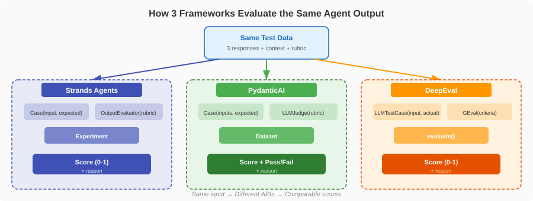

# How to Evaluate AI Agents - A Head-to-Head Framework Comparison

[](https://python.org) [](https://aws.amazon.com/bedrock/) [](https://strandsagents.com)

You built an AI agent. It calls tools, reasons over data, and produces answers. But **how do you know if it's production-ready?**

The evaluation landscape for AI agents grew rapidly in the past 6 months. Research papers from [arXiv](https://arxiv.org/) propose new metrics for trajectory quality ([TRACE](https://arxiv.org/abs/2602.21230)), hallucination detection ([LSC](https://arxiv.org/abs/2601.19918)), and cost-performance tradeoffs ([KAMI](https://arxiv.org/abs/2511.08042)). But when it comes to **implementing** these evaluations, which framework should you use?

This post compares three frameworks head-to-head by running the **exact same evaluation tasks** on the **exact same agent outputs**. No theory without code, only metrics and results you can reproduce in a Jupyter notebook.

---

## Why these 3 frameworks (and not CrewAI, LangGraph, or AutoGen)?

We [compared 8 agent frameworks](../FRAMEWORK_COMPARISON.md) for evaluation capabilities. Most popular frameworks (CrewAI, LangGraph, AutoGen, OpenAI Agents SDK, Google ADK) are designed for **building** agents, not evaluating them. They do not ship dedicated evaluation libraries.

These 3 were selected because they are the only ones with **dedicated, open-source evaluation SDKs**:

| Framework | Evaluation Library | What It Provides |
|-----------|-------------------|-----------------|
| [**Strands Agents**](https://strandsagents.com) | `strands-agents-evals` | OutputEvaluator, TrajectoryEvaluator, ToolCalled, ActorSimulator, Experiment runner |
| [**PydanticAI**](https://ai.pydantic.dev/evals/) | `pydantic-evals` | LLMJudge, typed Datasets with YAML, report diffing, HasMatchingSpan |
| [**DeepEval**](https://docs.confident-ai.com/) | `deepeval` (standalone) | 30+ metrics: GEval, HallucinationMetric, FaithfulnessMetric, ToolCorrectnessMetric |

**What about the others?**

| Framework | Why Not Included |
|-----------|-----------------|
| **CrewAI** (47K stars) | `crewai test` only supports OpenAI, provides basic 1-10 scoring. No rubrics, no trajectory eval, no hallucination detection. |
| **LangGraph** (27K stars) | Evaluation lives in **LangSmith** (paid SaaS), not in the open-source framework. |
| **AutoGen** (56K stars) | Has AutoGen Bench for benchmarking but no evaluation SDK with comparable metrics. |
| **OpenAI Agents SDK** (20K stars) | Provides tracing hooks but no evaluation library. Pair it with DeepEval to evaluate. |
| **Google ADK** (19K stars) | Has `adk eval` CLI but tightly coupled to the Gemini ecosystem. |

If you use CrewAI, LangGraph, or AutoGen to **build** your agent, you still need one of these 3 frameworks to **evaluate** it. DeepEval in particular is framework-agnostic and works with any agent.



---

## What evaluation tasks are we running?

We evaluate the same travel assistant agent scenario across all three frameworks. The agent answers questions from travelers using tools (search flights, check hotel availability, get weather).

1. **Output Quality** - Is the agent's answer helpful and accurate? (LLM-as-Judge)
2. **Tool Correctness** - Did the agent call the right tools with the right parameters?
3. **Hallucination Detection** - Did the agent fabricate information not in the context?
4. **Faithfulness** - Is the answer grounded in the retrieved information?

Same test cases. Same judge model ([Claude](https://docs.aws.amazon.com/bedrock/latest/userguide/models.html) on [Amazon Bedrock](https://aws.amazon.com/bedrock/)). Same rubrics where possible.

---

## How does LLM-as-Judge compare across frameworks?

LLM-as-Judge is the most fundamental evaluation technique: use a large language model to score whether the agent's output meets quality criteria. All three frameworks support this pattern, but the API differs significantly.

### Strands Agents (7 lines)

```python
from strands_evals import Experiment, Case
from strands_evals.evaluators import OutputEvaluator

cases = [
    Case(input="Find flights from NYC to London for next Friday",
         expected_output="Should include airline, price range, and departure times"),
]

evaluator = OutputEvaluator(
    rubric="Rate the response on helpfulness (0-1). A helpful response includes "
           "specific flight options with airlines, prices, and times. Penalize "
           "vague or generic responses.",
    model="us.anthropic.claude-sonnet-4-20250514-v1:0",
)

experiment = Experiment(cases=cases, evaluators=[evaluator])
reports = experiment.run_evaluations(lambda case: agent(case.input))
reports[0].display()
```

### PydanticAI (10 lines)

```python
from pydantic_evals import Case, Dataset
from pydantic_evals.evaluators import LLMJudge

dataset = Dataset(
    cases=[
        Case(
            name="flight_search",
            inputs="Find flights from NYC to London for next Friday",
            expected_output="Should include airline, price range, and departure times",
        ),
    ],
    evaluators=[
        LLMJudge(
            rubric="Rate the response on helpfulness. A helpful response includes "
                   "specific flight options with airlines, prices, and times. "
                   "Penalize vague or generic responses.",
            model="anthropic:claude-sonnet-4-6",
            include_input=True,
            include_expected_output=True,
            score={"include_reason": True},
        ),
    ],
)

report = dataset.evaluate_sync(lambda inputs: agent(inputs))
report.print(include_input=True)
```

### DeepEval (12 lines)

```python
from deepeval import evaluate
from deepeval.metrics import GEval
from deepeval.test_case import LLMTestCase, LLMTestCaseParams

test_case = LLMTestCase(
    input="Find flights from NYC to London for next Friday",
    actual_output=agent("Find flights from NYC to London for next Friday"),
    expected_output="Should include airline, price range, and departure times",
)

metric = GEval(
    name="Helpfulness",
    criteria="Rate the response on helpfulness. A helpful response includes "
             "specific flight options with airlines, prices, and times. "
             "Penalize vague or generic responses.",
    evaluation_params=[
        LLMTestCaseParams.INPUT,
        LLMTestCaseParams.ACTUAL_OUTPUT,
        LLMTestCaseParams.EXPECTED_OUTPUT,
    ],
    threshold=0.5,
)

result = evaluate(test_cases=[test_case], metrics=[metric])
```

### Verdict: Output Quality

| Aspect | Strands | PydanticAI | DeepEval |
|--------|:-------:|:----------:|:--------:|
| Lines of code | 7 | 10 | 12 |
| Bedrock native | Yes | Yes | Custom wrapper needed |
| Score format | 0.0-1.0 | 0.0-1.0 + pass/fail | 0.0-1.0 |
| Reason included | Yes | Yes (configurable) | Yes |
| Batch evaluation | `Experiment.run_evaluations()` | `Dataset.evaluate_sync()` | `evaluate()` |

**Strands** is the most concise. **PydanticAI** offers the most configuration (separate score vs. assertion modes). **DeepEval** requires the most setup but supports the widest range of custom criteria via [GEval](https://docs.confident-ai.com/docs/metrics-llm-evals).

---

## How do you evaluate tool correctness?

Tool correctness measures whether the agent called the right tools with the right parameters. This is critical for agents that interact with APIs and databases, because a wrong tool call can cause real-world side effects.

### Strands Agents (with trajectory extraction)

```python
from strands_evals import Experiment, Case
from strands_evals.evaluators import TrajectoryEvaluator
from strands_evals.extractors import tools_use_extractor

traj_eval = TrajectoryEvaluator(
    rubric="The agent should search for flights first, then check availability. "
           "Calling weather tools is optional but acceptable.",
    model="us.anthropic.claude-sonnet-4-20250514-v1:0",
)

cases = [
    Case(
        input="Find flights from NYC to London for next Friday",
        expected_trajectory=["search_flights", "check_availability"],
    ),
]

def task_with_trajectory(case):
    agent.messages = []
    response = agent(case.input)
    traj_eval.update_trajectory_description(
        tools_use_extractor.extract_tools_description(agent)
    )
    trajectory = tools_use_extractor.extract_agent_tools_used_from_messages(
        agent.messages
    )
    return {"output": str(response), "trajectory": trajectory}

experiment = Experiment(cases=cases, evaluators=[traj_eval])
reports = experiment.run_evaluations(task_with_trajectory)
```

**Bonus: Deterministic tool check (no LLM needed, zero cost)**

```python
from strands_evals.evaluators import ToolCalled

# Check if a specific tool was called (instant, no API call)
experiment = Experiment(
    cases=cases,
    evaluators=[ToolCalled(tool_name="search_flights")],
)
```

### PydanticAI (with span-based tool detection)

```python
from dataclasses import dataclass
from pydantic_evals import Case, Dataset
from pydantic_evals.evaluators import Evaluator, EvaluatorContext, HasMatchingSpan

dataset = Dataset(
    cases=[
        Case(
            name="flight_search",
            inputs="Find flights from NYC to London for next Friday",
            metadata={"expected_tools": ["search_flights", "check_availability"]},
        ),
    ],
    evaluators=[
        HasMatchingSpan(
            query={"name_contains": "search_flights"},
            evaluation_name="called_search_flights",
        ),
    ],
)

# Custom evaluator for full trajectory check
@dataclass
class ToolSequenceCheck(Evaluator):
    def evaluate(self, ctx: EvaluatorContext) -> dict[str, bool]:
        tool_spans = ctx.span_tree.find(lambda n: "tool" in n.name.lower())
        tool_names = [s.name for s in tool_spans]
        expected = ctx.metadata.get("expected_tools", [])
        return {
            "all_tools_called": all(t in tool_names for t in expected),
            "correct_order": self._check_order(tool_names, expected),
        }

    def _check_order(self, actual, expected):
        positions = []
        for tool in expected:
            if tool in actual:
                positions.append(actual.index(tool))
        return positions == sorted(positions)
```

### DeepEval (with ToolCall objects)

```python
from deepeval import evaluate
from deepeval.metrics import ToolCorrectnessMetric
from deepeval.test_case import LLMTestCase, ToolCall

test_case = LLMTestCase(
    input="Find flights from NYC to London for next Friday",
    actual_output="I found 3 flights...",
    tools_called=[
        ToolCall(name="search_flights", input_parameters={"origin": "NYC", "dest": "LHR"}),
        ToolCall(name="check_availability", input_parameters={"flight_id": "BA117"}),
    ],
    expected_tools=[
        ToolCall(name="search_flights", input_parameters={"origin": "NYC", "dest": "LHR"}),
        ToolCall(name="check_availability"),
    ],
)

metric = ToolCorrectnessMetric(
    threshold=0.5,
    should_consider_ordering=True,
    should_exact_match=False,
)

result = evaluate(test_cases=[test_case], metrics=[metric])
```

### Verdict: Tool Correctness

| Aspect | Strands | PydanticAI | DeepEval |
|--------|:-------:|:----------:|:--------:|
| Trajectory extraction | Built-in extractor | Via OpenTelemetry spans | Manual ToolCall objects |
| LLM-based trajectory eval | TrajectoryEvaluator | Custom evaluator | ToolCorrectnessMetric |
| Deterministic check | ToolCalled (zero-cost) | HasMatchingSpan | N/A |
| Ordering validation | in_order_match_scorer | Custom code | should_consider_ordering |
| Parameter validation | Via rubric | Via span attributes | should_exact_match |

**Strands** wins with built-in trajectory extraction from agent messages, with no manual wiring. **DeepEval** has the most structured ToolCall API. **PydanticAI** is the most flexible via span trees but requires more custom code.

---

## How do you detect hallucinations?

Hallucination detection measures whether the agent fabricates information not present in the source context. This is one of the most critical evaluation dimensions, with recent research ([LSC, Jan 2026](https://arxiv.org/abs/2601.19918)) showing that zero-shot detection methods can identify fabricated content without any training data.

### Strands Agents

```python
from strands_evals import Experiment, Case
from strands_evals.evaluators import OutputEvaluator

cases = [
    Case(
        input="What is the baggage policy for Delta flights to London?",
        expected_output="Based on the context: 2 checked bags, 23kg each, free for international",
    ),
]

hallucination_eval = OutputEvaluator(
    rubric="Score 1.0 if the response ONLY contains information present in the "
           "expected output (ground truth). Score 0.0 if the response includes "
           "any fabricated details such as specific prices, dates, or policies "
           "not mentioned in the ground truth. Partially correct responses "
           "should score between 0.3-0.7.",
    model="us.anthropic.claude-sonnet-4-20250514-v1:0",
)

experiment = Experiment(cases=cases, evaluators=[hallucination_eval])
reports = experiment.run_evaluations(lambda case: agent(case.input))
```

### PydanticAI

```python
from pydantic_evals import Case, Dataset
from pydantic_evals.evaluators import LLMJudge

dataset = Dataset(
    cases=[
        Case(
            name="baggage_policy",
            inputs="What is the baggage policy for Delta flights to London?",
            expected_output="Based on the context: 2 checked bags, 23kg each, free for international",
        ),
    ],
    evaluators=[
        LLMJudge(
            rubric="Does the response ONLY contain information present in the "
                   "expected output? Score 0.0 for fabricated details, 1.0 for "
                   "fully grounded responses.",
            model="anthropic:claude-sonnet-4-6",
            include_expected_output=True,
            score={"include_reason": True, "evaluation_name": "hallucination"},
            assertion={"include_reason": True, "evaluation_name": "grounded"},
        ),
    ],
)

report = dataset.evaluate_sync(lambda inputs: agent(inputs))
```

### DeepEval (dedicated HallucinationMetric)

```python
from deepeval import evaluate
from deepeval.metrics import HallucinationMetric
from deepeval.test_case import LLMTestCase

test_case = LLMTestCase(
    input="What is the baggage policy for Delta flights to London?",
    actual_output=agent("What is the baggage policy for Delta flights to London?"),
    context=[
        "Delta international flights include 2 checked bags at 23kg each, free of charge.",
        "Carry-on must fit in overhead bin. One personal item allowed.",
    ],
)

metric = HallucinationMetric(threshold=0.5)
result = evaluate(test_cases=[test_case], metrics=[metric])
```

### Verdict: Hallucination Detection

| Aspect | Strands | PydanticAI | DeepEval |
|--------|:-------:|:----------:|:--------:|
| Dedicated metric | No (via OutputEvaluator rubric) | No (via LLMJudge rubric) | **Yes (HallucinationMetric)** |
| Context as input | Via expected_output | Via expected_output | **Dedicated context field** |
| Scoring method | LLM judge with rubric | LLM judge with rubric | Claim-by-claim verification |
| Granularity | Single score | Score + assertion | **Per-context contradiction count** |

**DeepEval** wins here with a purpose-built `HallucinationMetric` that decomposes claims and checks each against context. **Strands** and **PydanticAI** use general-purpose LLM-as-judge with custom rubrics. This approach is flexible but less specialized for hallucination detection.

---

## How does batch evaluation work across frameworks?

Real-world evaluation runs multiple metrics on multiple test cases at the same time. This section compares how each framework handles parallel execution, mixed metric types, and reporting.

### Strands Agents

```python
from strands_evals import Experiment, Case
from strands_evals.evaluators import (
    OutputEvaluator, TrajectoryEvaluator, ToolCalled,
)

cases = [
    Case(input="Find flights NYC to London",
         expected_output="Flight options with prices",
         expected_trajectory=["search_flights"]),
    Case(input="What's the weather in Paris tomorrow?",
         expected_output="Temperature and conditions",
         expected_trajectory=["get_weather"]),
    Case(input="Book hotel in Tokyo for 3 nights",
         expected_output="Booking confirmation with dates and price",
         expected_trajectory=["search_hotels", "book_hotel"]),
]

experiment = Experiment(
    cases=cases,
    evaluators=[
        OutputEvaluator(rubric="Is the response helpful and specific?"),
        TrajectoryEvaluator(rubric="Did the agent use the right tools?"),
        ToolCalled(tool_name="search_flights"),
    ],
)

reports = experiment.run_evaluations(task_function)
for report in reports:
    report.display()
```

### PydanticAI

```python
from pydantic_evals import Case, Dataset
from pydantic_evals.evaluators import LLMJudge, EqualsExpected, HasMatchingSpan

dataset = Dataset(
    cases=[
        Case(name="flights", inputs="Find flights NYC to London",
             expected_output="Flight options with prices"),
        Case(name="weather", inputs="What's the weather in Paris tomorrow?",
             expected_output="Temperature and conditions"),
        Case(name="hotel", inputs="Book hotel in Tokyo for 3 nights",
             expected_output="Booking confirmation with dates and price"),
    ],
    evaluators=[
        LLMJudge(rubric="Is the response helpful and specific?",
                 score={"include_reason": True}),
    ],
)

report = dataset.evaluate_sync(task_function, max_concurrency=3)
report.print(include_input=True, include_averages=True)
```

### DeepEval

```python
from deepeval import evaluate
from deepeval.metrics import (
    GEval, AnswerRelevancyMetric, HallucinationMetric, ToolCorrectnessMetric,
)
from deepeval.test_case import LLMTestCase, LLMTestCaseParams
from deepeval.evaluate.configs import AsyncConfig

test_cases = [build_test_case(q) for q in questions]

metrics = [
    GEval(name="Helpfulness",
          criteria="Is the response helpful and specific?",
          evaluation_params=[LLMTestCaseParams.INPUT, LLMTestCaseParams.ACTUAL_OUTPUT]),
    AnswerRelevancyMetric(threshold=0.7),
    HallucinationMetric(threshold=0.5),
]

result = evaluate(
    test_cases=test_cases,
    metrics=metrics,
    async_config=AsyncConfig(max_concurrent=5),
)
```

### Verdict: Batch Evaluation

| Aspect | Strands | PydanticAI | DeepEval |
|--------|:-------:|:----------:|:--------:|
| Parallel execution | `run_evaluations_async()` | `max_concurrency` param | `AsyncConfig(max_concurrent=N)` |
| Mixed metric types | LLM + deterministic | LLM + deterministic + span | LLM only (30+ metrics) |
| Report format | Rich table via `.display()` | Rich table via `.print()` | Console + Confident AI dashboard |
| Report diffing | No | **Yes (`baseline=` param)** | Via Confident AI |
| Export | JSON file | YAML/JSON file | JSON/CSV + cloud |

**PydanticAI** has the best reporting with baseline diffing (compare v1 vs v2). **DeepEval** has the most metrics out-of-the-box. **Strands** has the cleanest API for mixing LLM and deterministic evaluators.

---

## What is the complete feature comparison?

This table summarizes every evaluation capability across all three frameworks. Use it as a reference when choosing a framework for your specific evaluation needs.

| Feature | Strands + evals | PydanticAI + evals | DeepEval |
|---------|:-:|:-:|:-:|
| **LLM-as-Judge** | OutputEvaluator | LLMJudge | GEval |
| **Trajectory evaluation** | TrajectoryEvaluator + extractors | SpanTree + custom | ToolCorrectnessMetric |
| **Hallucination detection** | Via rubric | Via rubric | HallucinationMetric |
| **Faithfulness** | FaithfulnessEvaluator (trace) | Via rubric | FaithfulnessMetric |
| **Deterministic checks** | Equals, Contains, ToolCalled | Equals, Contains, IsInstance | N/A |
| **Multi-agent evaluation** | InteractionsEvaluator | Custom evaluator | N/A |
| **Multi-turn simulation** | ActorSimulator | N/A | ConversationalTestCase |
| **Test case generation** | ExperimentGenerator | N/A | `deepeval generate` |
| **Bedrock native** | Yes | Yes | Custom wrapper |
| **OpenTelemetry** | Built-in | Via Logfire | N/A |
| **Dataset serialization** | JSON | YAML/JSON | JSON/CSV |
| **Report comparison** | No | Baseline diffing | Confident AI |
| **pytest integration** | Via Experiment | `dataset.evaluate_sync()` | `assert_test()` / `deepeval test` |
| **Total built-in metrics** | 12 evaluators | 6 evaluators + custom | 30+ metrics |

### When to use each framework

| Use Case | Best Choice | Why |
|----------|-------------|-----|
| Building agents on **AWS Bedrock** | **Strands** | Native Bedrock, AgentCore path, built-in metrics |
| **Type-safe** evaluation pipelines | **PydanticAI** | Strongest typing, YAML datasets, report diffing |
| Most **metrics out-of-the-box** | **DeepEval** | 30+ metrics, hallucination/faithfulness specialized |
| **Trajectory + tool** evaluation | **Strands** | Built-in extractors, TrajectoryEvaluator, deterministic checks |
| **Multi-agent** evaluation | **Strands** | InteractionsEvaluator, Swarm/Graph orchestration |
| **Multi-turn** simulation | **Strands** | ActorSimulator with dynamic conversation generation |
| **Framework-agnostic** evaluation | **DeepEval** | Works with any agent framework, no coupling |
| **Report comparison** across runs | **PydanticAI** | Baseline diffing built into `.print()` |

---

## Try it yourself

The companion notebook runs all comparisons with live code. You can reproduce every result from this post.

| Notebook | What It Covers |
|----------|---------------|
| [**01-framework-comparison.ipynb**](./01-framework-comparison.ipynb) | Side-by-side comparison of all 3 frameworks on the same evaluation tasks |

### Setup

```bash
cd blog-framework-comparison
python3 -m venv .venv
source .venv/bin/activate
pip install -r requirements.txt
```

### Run

```bash
jupyter notebook 01-framework-comparison.ipynb
```

---

## Frequently asked questions

**Which framework has the lowest learning curve?**
Strands Agents requires the fewest lines of code (7 lines for LLM-as-Judge). PydanticAI is close at 10 lines. DeepEval requires the most setup, especially for non-OpenAI models where you need a custom wrapper class.

**Can I use Amazon Bedrock as the judge model in all three?**
Strands and PydanticAI support Bedrock natively (one-line configuration). DeepEval requires a custom `DeepEvalBaseLLM` wrapper that maps Bedrock's API to DeepEval's interface. The wrapper adds approximately 25 lines of code.

**Do I need OpenTelemetry for evaluation?**
Only for trace-based evaluators in Strands (such as `FaithfulnessEvaluator` and `ToolSelectionAccuracyEvaluator`). Output-based evaluators in all three frameworks work without OpenTelemetry. PydanticAI uses OpenTelemetry via [Logfire](https://pydantic.dev/logfire) for span-based evaluation.

**What about evaluation cost?**
Every LLM-based evaluator makes API calls to the judge model, which incurs token costs. Strands provides deterministic evaluators (such as `ToolCalled`, `Equals`, `Contains`) that run instantly at zero cost. DeepEval and PydanticAI also have deterministic options (`Equals`, `Contains`, `IsInstance`).

**Can I combine frameworks?**
Yes. You can use DeepEval's specialized metrics (such as `HallucinationMetric`) alongside Strands Agents for the agent runtime and trajectory capture. The frameworks evaluate outputs, not agents directly, so the agent framework and evaluation framework are independent choices.

---

## Conclusion

There is no single "best" evaluation framework. The right choice depends on your stack and priorities.

**Strands Agents** is the most cohesive option if you build on AWS. Agent creation, tool calling, trajectory capture, and evaluation live in the same ecosystem. The hooks system and built-in metrics mean evaluation is instrumented into the agent runtime, not bolted on after the fact. **PydanticAI** is the most elegant option if you value type safety and structured evaluation pipelines. YAML datasets, report diffing, and the `Evaluator` protocol make it ideal for teams that want evaluation-as-code with strong guarantees. **DeepEval** is the most comprehensive option if you want specialized metrics without building them yourself. Over 30 metrics, including purpose-built hallucination detection and faithfulness checking, let you evaluate immediately without writing custom rubrics.

The evaluation concepts (LLM-as-judge, trajectory scoring, hallucination detection) are framework-independent. The [research papers](../RESEARCH.md) and techniques behind them work regardless of which framework you choose. For the full list of 45+ papers that informed this comparison, see the [RESEARCH.md](../RESEARCH.md) file.

---

## Contributing

Contributions are welcome! See [CONTRIBUTING](../CONTRIBUTING.md) for more information.

---

## Security

If you discover a potential security issue in this project, notify AWS/Amazon Security via the [vulnerability reporting page](http://aws.amazon.com/security/vulnerability-reporting/). Please do **not** create a public GitHub issue.

---

## License

This library is licensed under the MIT-0 License. See the [LICENSE](../LICENSE) file for details.
