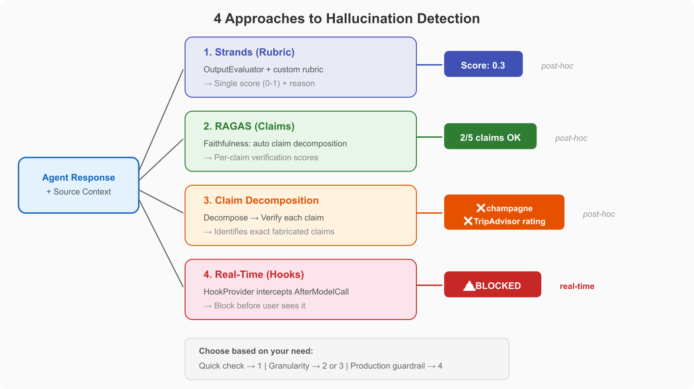

# Detect AI Agent Hallucinations

[](https://python.org) [](https://aws.amazon.com/bedrock/)

Hallucination detection measures whether an AI agent fabricates information not present in its source context. This is one of the most critical evaluation dimensions: an agent that confidently invents facts is worse than one that says "I don't know."

This section compares three approaches to hallucination detection, giving you options depending on your stack and requirements. Similar patterns apply in other agent frameworks such as LangGraph, PydanticAI, or AutoGen.

## Demos

| Demo | Focus | Frameworks | Time |
|------|-------|------------|------|
| [**01 - Strands vs RAGAS**](./01-strands-vs-ragas-hallucination/) | Head-to-head comparison: same test cases, different evaluation frameworks | Strands evals + RAGAS | 25 min |
| [**02 - Claim Decomposition**](./02-claim-decomposition/) | Break responses into atomic claims and verify each against context | Strands Agents | 20 min |
| [**03 - Real-Time Detection with Hooks**](./03-realtime-hallucination-hooks/) | Detect hallucinations during agent execution using Strands hooks | Strands Agents | 20 min |

## Key Concepts

**Faithfulness** measures whether the response is grounded in the retrieved context. A faithful response only contains information present in the context, even if additional true facts exist.

**Claim decomposition** breaks a response into atomic factual claims and verifies each independently. This gives per-claim granularity instead of a single score. Based on [VISTA](https://arxiv.org/abs/2510.27052) (Oct 2025).

**Real-time detection** uses Strands hooks to intercept agent outputs and check for hallucinations before they reach the end user. Based on [StepShield](https://arxiv.org/abs/2601.22136) (Jan 2026).



## Choosing Your Framework

| Need | Best Choice | Why |
|------|-------------|-----|
| Quick evaluation of agent outputs | **Strands evals** | `OutputEvaluator` with rubric, 5 lines of code |
| Specialized faithfulness/grounding metrics | **RAGAS** | Purpose-built `Faithfulness` and `ResponseGroundedness` metrics |
| Per-claim granularity | **Claim decomposition** (Demo 02) | Identifies exactly which claims are fabricated |
| Prevent hallucinations before they reach users | **Hooks** (Demo 03) | Intercepts outputs in real-time during agent execution |

## Prerequisites

```bash
cd detect-hallucinations
python3 -m venv .venv
source .venv/bin/activate
pip install strands-agents strands-agents-evals ragas litellm boto3
```
