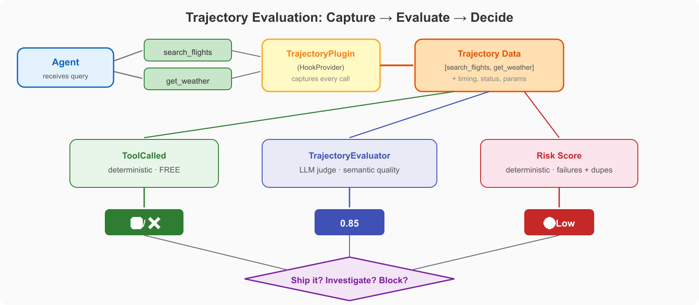

# Evaluate Agent Trajectories

[](https://python.org) [](https://aws.amazon.com/bedrock/)

Trajectory evaluation scores the step-by-step path an agent takes, not the final answer. An agent can produce the right output through the wrong tools, unnecessary loops, or unsafe intermediate steps. Evaluating trajectories catches these issues.

This section implements three research-backed techniques. Similar patterns apply in other agent frameworks such as LangGraph, PydanticAI, or AutoGen.

## Demos

| Demo | Focus | Paper | Time |
|------|-------|-------|------|
| [**01 - Trajectory Scoring**](./01-trajectory-scoring/) | Capture tool call sequences with hooks and score them with TrajectoryEvaluator | [TRACE](https://arxiv.org/abs/2602.21230) (Feb 2026) | 20 min |
| [**02 - Trajectory Risk Analysis**](./02-trajectory-risk-analysis/) | Measure risk signals: tool failures, repeated calls, excessive duration | [TRACER](https://arxiv.org/abs/2602.11409) (Feb 2026) | 20 min |
| [**03 - Variance and Multiple Runs**](./03-variance-multiple-runs/) | Run the same evaluation N times to measure score stability | [On Randomness](https://arxiv.org/abs/2602.07150) (Feb 2026) | 15 min |

## Key Concepts

**Trajectory** = the ordered sequence of tool calls an agent makes to answer a question. For example: `[search_flights, check_availability, book_hotel]`.

**Why evaluate trajectories?** Two agents can produce the same answer but through different paths. Agent A calls `search_flights` once. Agent B calls `search_flights` 5 times, calls `get_weather` (irrelevant), and retries `search_flights` again. Both return the same flights, but Agent B wasted tokens and made unnecessary API calls.

**Risk signals** in trajectories include: tool call failures, duplicate calls, calls to irrelevant tools, excessive model reasoning cycles, and high latency per step.



## Prerequisites

```bash
cd evaluate-agent-trajectories
python3 -m venv .venv
source .venv/bin/activate
pip install strands-agents strands-agents-evals boto3
```
