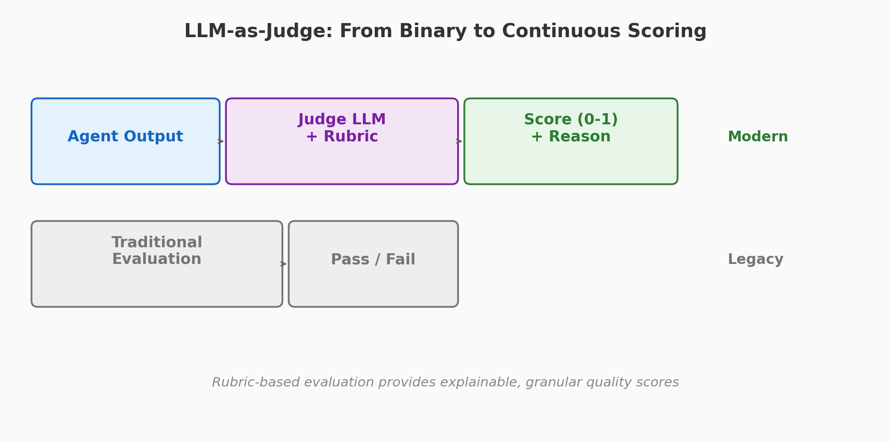

# Evaluate AI Agents with LLM Judges

[](https://python.org) [](https://aws.amazon.com/bedrock/)

LLM-as-Judge is the most widely adopted evaluation technique for AI agents. Instead of manual review, you use a large language model to score agent outputs against defined criteria.

This section implements three research-backed techniques for building reliable LLM judges. Similar patterns apply in other agent frameworks such as LangGraph, PydanticAI, or AutoGen.

## Demos

| Demo | Focus | Paper | Time |
|------|-------|-------|------|
| [**01 - Rubric-Based Evaluation**](./01-rubric-based-evaluation/) | Define scoring rubrics and evaluate agent outputs with OutputEvaluator | [Autorubric](https://arxiv.org/abs/2603.00077) (Mar 2026) | 15 min |
| [**02 - Judge Bias Detection**](./02-judge-bias-detection/) | Detect and measure position bias, verbosity bias, and self-enhancement bias | [Position Bias](https://arxiv.org/abs/2602.02219) (Feb 2026) | 20 min |
| [**03 - Multi-Judge Ensemble**](./03-multi-judge-ensemble/) | Use multiple judge models and aggregate scores for reliability | [Autorubric](https://arxiv.org/abs/2603.00077), [SCOPE](https://arxiv.org/abs/2602.13110) | 20 min |

## Key Concepts

**Rubric-based evaluation** defines explicit scoring criteria so the judge produces consistent, explainable scores. Research shows the 0-5 scale yields the strongest human-LLM alignment ([Grading Scale, Jan 2026](https://arxiv.org/abs/2601.03444)).

**Judge bias** is a real problem. LLM judges exhibit position bias (preferring the first or last option), verbosity bias (preferring longer responses), and self-enhancement bias (rating their own outputs higher). Detection and mitigation are essential for trustworthy evaluation.

**Multi-judge ensembles** reduce the impact of any single judge's biases. By aggregating scores from multiple models or multiple prompt orderings, you get more reliable evaluation results.



## Prerequisites

```bash
cd evaluate-with-llm-judges
python3 -m venv .venv
source .venv/bin/activate
pip install strands-agents strands-agents-evals boto3
```
